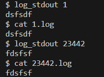
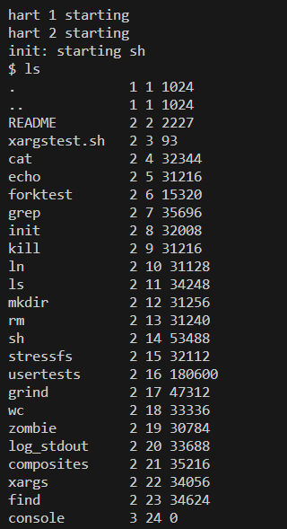
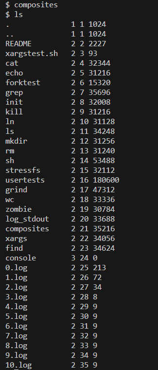
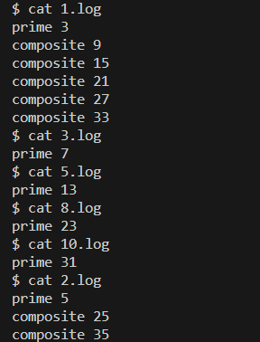
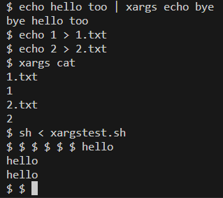
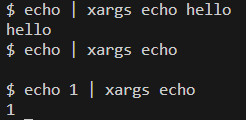

Lab-0 report

刘卓瀚-21307130254

2023-9-22

# task1
### 实现思路
0. log_stdin：直接要求读1024字节，返回值不为-1就ok
1. 先使用open函数打开xxx.log文件
2. 再关闭stdout
3. 使用dup函数获取一个新的文件描述符指向xxx.log文件，因为dup函数会使用可用的最小的文件描述符，而stdout文件描述符为1，刚才被关闭了所以是可用的，我们默认stdin是打开着的，所以文件描述符1会指向xxx.log文件，以后向stdout输出会重定向到xxx.log
4. 检查dup返回的文件描述符是否为1，如果不是则重定向失败，有可能是因为stdin被关闭
### 测试结果

### 实验中遇到的问题，如何思考并解决
- 将数字转为字符串的时候不小心数组越界了，但是没报错（这就是c的弊端！），后来检查出来了

# task2
### 实现思路
1. 先读懂题：第i子进程对于父进程给它传递的一串数字，打印第一个数字的所有倍数（包括自身）到i.log，然后fork一个子进程，传递剩下的数到下一个子进程中，再执行相同的步骤，直到所有数打印完；初始进程传递2~35到子进程0；每个进程都要等它的所有子进程（包括子进程的子进程，子进程的子进程的子进程，...）退出后才退出；在这个流水线中，每个进程中打印的第一个数是质数，其他都是合数
2. 使用pipe()函数在进程间建立管道用于通信，`p_left`意为父进程和当前进程间的管道，`p_right`意为当前进程和其子进程间的管道；父进程通过管道的写口向子进程发送数字
4. 进程使用循环从管道中读数据，整除则打印，否则建立管道，同时fork一个子进程把数传递给它；先初始化`p_right[0] = p_right[1] = -1`，需要则建立管道，此时`p_right >= 0`，通过对p_right判断管道是否建立
5. 使用fork建立子进程，判断返回的pid：为0，表示子进程在运行，则递归调用`sub_process(p_right, i + 1)`；不为0，表示当前进程在运行，继续数据传输
6. 进程向子进程传输完数据就关闭管道的写口，这时子进程再read会返回0，因此停止读入
7. 进程关闭管道写口后使用`wait()`函数等待子进程的结束，每个进程都要等待它的子进程结束才结束
8. 出现问题：某个进程建立管道失败，应该是文件描述符不够用了，考虑到子进程自始至终不需要向父进程传递信息，所以我们在一开始将`p_left[1]`关闭
9. `composites()`函数中，使用类似的流程，建立管道，fork子进程，向子进程0发送2~35，然后关闭写口，等待子进程结束
### 测试结果

### 实验中遇到的问题，如何思考并解决
- 一开始实现父进程等待子进程终止再终止的实现方案是子进程再向父进程发送一个标识符，但是这样会导致文件标识符不够用，所以改用`wait()`函数
- 不知道为何没有输出，原来是重定向了，debug时取消重定向，结果所有进程的打印混合在一起（因为进程调度不确定，printf函数不是原子的），以为出bug了，后来意识到重定向之后会输出到不同的文件
- 在完成读入数据、传递数据后再关闭`p_left[1]`发现文件描述符还是不够用，所以在一开始将`p_left[1]`关闭
- 如果没有建立管道就不用close，所以初始化`p_right[0] = p_right[1] = -1`并以此为判断依据

# task3
### 实现思路
1. 判断参数数量需要>=2
2. 重新建立`char *args[MAXARG]`参数表，将原有参数复制过来（不包括第1个参数，其为xargs的文件名）；使用strlen + malloc + strcpy完成复制；维护cnt表示已获取的参数数量
3. `run()`函数：参数为`args`，其功能是fork一个子进程，执行`exec(args[0], args)`
4. 使用malloc为一行参数分配至多128字节的空间，最后一个参数设置为NULL，但xv6没有NULL所以设为0
5. 维护idx表示这一行参数中待写的位置，每次从stdin读入一个字符，如果read返回0则退出，否则判断读入的字符：为`'\n'`，则一行参数已读完，放入字符串终止符，执行`run()`函数，然后重置`idx = 0`；否则将字符写入，同时更新idx
6. 对字符串长度和参数数量的检查
7. 使用系统自带的xargs发现：当遇到空白行的时候不会执行`exec(args[0], args)`；当没遇到`'\n'`就读入终止时仍会执行（除非为空白行）；当一次都没有执行时，会至少保证执行一次，所以添加修改，使用`idx`作为判断依据：idx初始置为-1，当至少读入了一个有效字符，令`idx >= 0`，遇到换行符时若`idx <= 0`则不执行；循环结束后若`idx > 0`（说明没遇到`'\n'`就读入终止）或者`idx = -1`（说明一次都没有执行）则再执行一次。
8. 释放malloc分配的空间
### 测试结果

### 实验中遇到的问题，如何思考并解决
- 一开始忘记将最后一个参数设为NULL了，不然怎么知道参数表的边界
- 一开始使用二维数组作为参数表，但之后发现二维数组每个数组指针是固定的，没办法将最后一个参数指针设为NULL，所以改用malloc动态分配