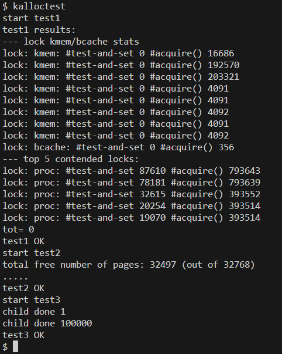
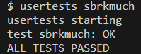
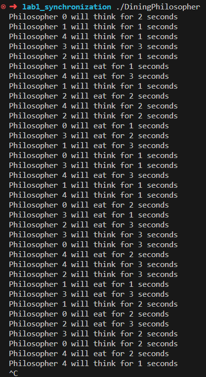

<center><font size=5>Lab-1 report</font></center>
<p align='right'>刘卓瀚-21307130254</p>
<p align='right'>2023-10-1</p>

# task 1
### 问题回答
- 举一个例子说明修改前的kernel/kalloc.c中如果没有锁会导致哪些进程间竞争(races)问题：
比如两个进程同时运行到需要修改共同的空闲链表的代码
```c
r = kmem.freelist;
if (r)
    kmem.freelist = r->next;
```
`r`对应的值是一样的（因为在执行`r = kmem.freelist`时还没有修改`kmem.freelist`），所以两个进程都被分配到同一块内存，而不是不同的内存
- 说明修改前的kernel/kalloc.c中锁竞争(contention)问题及其后果：由于锁只有一个，因此多个进程需要分配或释放空间的时候会竞争这个锁，后果是：
    - 这些进程无法很好地并发执行，降低了处理效率
    - 当进程因为锁被占用而阻塞，如果选择一直阻塞则浪费cpu时间，如果选择让出也会带来频繁的上下文切换
- 解释acquire和release中push_off/pop_off的作用：屏蔽中断和解除屏蔽，目的是在防止出现以下情况：在获取cpuID之前也要获取锁，如果已经获取锁之后出现中断，中断处理程序也想获取cpuID，就会再次想要获取锁，而锁已经被获取，中断处理程序就会被阻塞，而原程序也会因为中断处理程序未执行完而被阻塞，形成死锁
### 实现思路
- 维护NCPU个kmem结构，将总共的空间分为NCPU份，每个CPU分一份，每个CPU维护各自的空闲链表和锁
- 修改kinit，需初始化每个CPU的锁；修改freerange函数，构造kfreeID辅助函数（将指定cpuID的空闲链表指向的空间free掉），freerange函数将总体的空间分为NCPU份，对于每一份，调用kfreeID构造对应ID的CPU的空闲链表
- 修改kalloc和kfree，在开头获取调用者的cpuID，并对`kmem[cpuID]`进行操作，在获取cpuID之前调用push_off，之后调用pop_off
- 在当前CPU无空闲页面时，遍历其他CPU的空闲链表，找到第一个空闲空间并进行分配（相当于让其他CPU调用了kalloc函数，空间自己使用）
### 测试结果



# task 2
## 复旦早餐王问题
- 互斥：篮子只有一个，鸡蛋灌饼和煎饼果子不能同时放入篮子中；同步，鸡蛋灌饼和煎饼果子的制作和出售是同时进行的
- 5个进程：监视进程、鸡蛋灌饼制作进程、煎饼果子制作进程、鸡蛋灌饼排队进程、煎饼果子排队进程
    - 监视进程中以全局变量方式存储篮子的状态信息、队伍信息和已做好的食物数量信息，并且维护三个锁，fork四个子进程来制作和出售
    ```c
    struct Basket
    {
        int type;
    } basket;
    queue<int> jdgb,jbgz;
    int producedJdgb,producedJbgz;
    lock lock1;
    lock lock2;
    lock lock3;
    ```
    - 制作进程检测到队伍不为空就一直制作
    ```c
    while(1)
    {
        if(produced < queue.length())
        {
            produce();
            produced++;
        }
        if(basket.type == empty)
        {
            basket.type = jdgb;
        }
    }
    ```
    - 每当排队进程检测到有人来排队的时候，将其加入队伍中；当发现篮子中有相应食物，则取走
    ```c
    while(1)
    {
        if(someoneCome)
        {
            jdgb.push();
        }
        if(!jdgb.empty() && basket.type == jdgb)
        {
            jdgb.pop();
            basket.type = empty;
            producedJdgb--;
        }
    }
    ```
    - 在调用篮子的状态信息、队伍信息变量和已做好的食物数量信息时都要上锁和解锁

## 哲学家就餐问题
### 使用的方法
- 进入文件夹内
```shell
make clean && make DiningPhilosopher
```
- 运行
```
./DiningPhilosopher
```
### 实现思路
- 5个锁代表5双筷子，构造辅助宏函数`LEFT(x)`和`RIGHT(x)`表示左右手边的筷子
- pickup()：给左右手边的筷子上锁
- putdown()：给左右手边的筷子解锁
- 如果上锁的顺序都一致（比如都先给左手筷子上锁，再给右手筷子上锁），会导致死锁：当所有人都拿起左手筷子，这时候所有人都拿不起右手筷子；所以我们改变一个人拿筷子的顺序来避免死锁，把0号哲学家改为先拿右手筷子再拿左手筷子
### 运行结果
