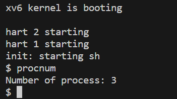
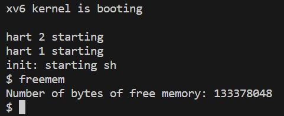
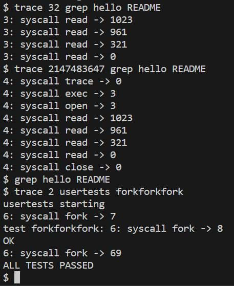

<center><font size=5>Lab-2 report</font></center>
<p align='right'>刘卓瀚-21307130254</p>
<p align='right'>2023-10-11</p>

# task 1
### 实现思路
- sys_procnum实现思路：
  - 在`proc.c`中添加函数`nproc`，统计使用的进程数
  - 使用`argaddr`函数获取传入的`int *`参数，调用`nproc`函数获取使用的进程数，使用`copyout`函数在指定地址中写入此数

```c
int nproc(void)
{
  int cnt = 0;
  for (int i = 0; i < NPROC; i++)
  {
    acquire(&proc[i].lock);
    if (proc[i].state != UNUSED)
    {
      cnt++;
    }
    release(&proc[i].lock);
  }
  return cnt;
}
```
```c
uint64 sys_procnum(void)
{
  // your implementation here.
  uint64 ptr;
  argaddr(0, &ptr);
  struct proc *p = myproc();
  int num = nproc();
  return copyout(p->pagetable, ptr, (char *)&num, __SIZEOF_INT__);
}
```
### 测试结果

### 实验中遇到的问题，如何思考并解决
- 不知道怎么获取参数，后来仔细了解之后解决
- 直接访问传入的地址，发现报错，后来研究了一下其他系统调用函数，发现数据交换要使用`copyout`函数

# task 2
### 实现思路
- sys_freemem实现思路：
  - 在`kalloc.c`中添加函数`nfreemem`，统计空闲内存空间
  - 使用`argaddr`函数获取传入的`int *`参数，调用`nfreemem`函数获取使用的进程数，使用`copyout`函数在指定地址中写入此数

```c
int nfreemem(void)
{
  acquire(&kmem.lock);
  int num = 0;
  for (struct run *r = kmem.freelist; r; r = r->next)
  {
    num += PGSIZE;
  }
  release(&kmem.lock);
  return num;
}
```
```c
uint64 sys_freemem(void)
{
  // your implementation here.
  uint64 ptr;
  argaddr(0, &ptr);
  struct proc *p = myproc();
  int num = nfreemem();
  return copyout(p->pagetable, ptr, (char *)&num, __SIZEOF_INT__);
}
```
### 测试结果

### 实验中遇到的问题，如何思考并解决
问题同task1

# task 3
### 实现思路
- 在`struct proc`中添加`int`类型的`mask`成员，表示要跟踪的标志
- 在`syscall.c`中的`syscall`函数中，对于执行完的系统调用，如果进程号在`mask`中被设置了跟踪，则打印信息（pid，系统调用函数的名称，返回值）；系统调用函数的名称通过建立一个全局字符串数组来实现，下标为调用号的数据是系统调用函数的名称
- `sys_trace`：使用`argint`函数获取参数，根据参数设置当前进程的`mask`
- 在`proc.c`中的`freeproc`函数中，释放进程时设置`mask = 0`，防止影响下一个进程
```c
uint64 sys_trace(void)
{
  // your implementation here.
  int mask;
  argint(0, &mask);
  struct proc *p = myproc();
  acquire(&p->lock);
  p->mask = mask;
  release(&p->lock);
  return 0;
}
```
### 测试结果

### 实验中遇到的问题，如何思考并解决
- 进程初始化和释放的时候没有初始化`mask`，解决是在`proc.c`中的`freeproc`函数中，释放进程时设置`mask = 0`

# task 4
### 1.请概述用户从发出系统调用指令到得到返回结果的执行的流程
先执行入口指令（`user/usys.pl`中的`entry`定义的指令），它将寄存器`a7`的值设为系统调用函数的系统调用号，然后执行`ecall`指令，会陷入`usertrap`函数中，进入内核态，然后执行`syscall`函数，`syscall`会根据传入的系统调用号（通过进程中维护的`trapframe`来传递）执行相应的系统调用函数，系统调用函数返回后，`syscall`函数将其返回值放入`trapframe`中的`a0`寄存器，通过`trapframe`传回给用户，用户得到返回结果

### 2.搜索资料，概述malloc的底层实现原理
维护一个空闲链表，空闲链表中存储空闲块的信息，调用malloc时，扫描空闲链表，看看有没有大于需要分配空间（还包括一些如块头部的其他信息）的空闲块，如果有，那么将此空间分割成两个内存块，一个变成分配块，一个变成新的空闲块；如果没有，就使用`sbrk()`函数推进`brk`指针来扩大堆空间，再进行分配；分配内存的地址是虚拟地址，真正访问的时候才会通过缺页中断分配物理内存  
释放时，首先搜索空闲链表，找到可以插入被释放块的合适位置，然后释放内存空间；如果被释放块还和其他空闲块相邻，那么会将这些块合并为一个大的空闲块。