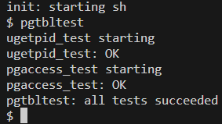
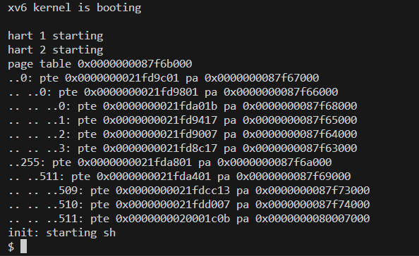
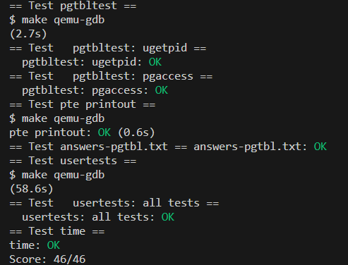
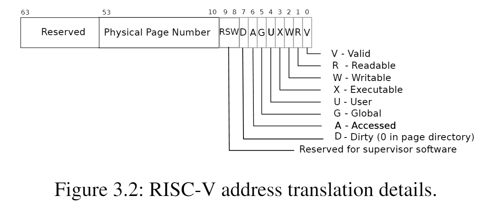
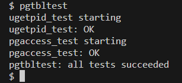

<center><font size=5>Lab-2 report</font></center>
<p align='right'>刘卓瀚-21307130254</p>
<p align='right'>2023-10-11</p>

# task 1
### 实现思路
- 分配一块空间来保存进程的pid，并把这块空间加入到页表的映射中，并且设定用户可访问，这样用户就可以直接访问这块空间来获取进程pid，而不需要通过系统调用来获取
- 在`kernel/proc.h`的`proc`结构体中添加一项指针`struct usyscall *upid`，指向保存pid的结构体
- 在`kernel/proc.c`的`allocproc()`中，在建立pagetable之前调用`kalloc()`分配一块空间存储保存pid的结构体，并将当前进程的pid存储进去
- 在`kernel/proc.c`的`proc_pagetable()`中使用`mappages()`建立映射，将指定地址`USYSCALL`映射到`upid`指向的空间，并将这个映射（PTE）写入pagetable中，权限是用户态可读，这样用户可通过`USYSCALL`来访问`upid`指向的空间，即访问进程的pid
- 在`kernel/proc.c`的`freeproc()`中，释放`upid`指向的空间（如果存在）
- 在`kernel/proc.c`的`proc_freepagetable()`中解除`USYSCALL`到`upid`的映射关系
### 测试结果

### 实验中遇到的问题，如何思考并解决
- pgtbltest没过一直以为有问题，原来是要完成实验3才能一起过

# task 2
### 实现思路
参考`freewalk`函数
```c
void vmprint(pagetable_t pagetable, int level)
{
  if (level == 0)
  {
    printf("page table %p\n", pagetable);
  }
  for (int i = 0; i < 512; i++)
  {
    pte_t pte = pagetable[i];
    if (pte & PTE_V)
    {
      printf("..");
      for (int j = 0; j < level; j++)
      {
        printf(" ..");
      }
      uint64 pa = PTE2PA(pte);
      printf("%d: pte %p pa %p\n", i, pte, pa);
      if ((pte & (PTE_R | PTE_W | PTE_X)) == 0)
      {
        vmprint((pagetable_t)pa, level + 1);
      }
    }
  }
}
```
- 通过`level`表示这是几级页表，并且根据格式打印出`pte`和`pa`
- 通过`pte`来判断是否有下一级页表：参考`freewalk()`函数，如果这一页表项显示为valid但不能read、write和execute，那么就判断这个页表项实际指向下一级页表
- 如果有下一级页表，则递归调用`vmprint`

### 测试结果


### 实验中遇到的问题，如何思考并解决
- 无

# task 3
### 实现思路
```c
int sys_pgaccess(void)
{
  // lab pgtbl: your code here.
  uint64 base;
  int len;
  uint64 mask;
  argaddr(0, &base);
  argint(1, &len);
  argaddr(2, &mask);
  if (len > 32)
  {
    return -1;
  }
  if (base + PGSIZE * len >= MAXVA)
  {
    return -1;
  }
  uint temp = 0;
  pte_t *pte;
  struct proc *p = myproc();
  for (int i = 0; i < len; i++)
  {
    pte = walk(p->pagetable, base + PGSIZE * i, 0);
    if (*pte & PTE_A)
    {
      temp = temp | (1 << i);
      *pte = *pte ^ PTE_A;
    }
  }
  return copyout(p->pagetable, mask, (char *)&temp, sizeof(temp));
}
```
- 在`kernel/riscv.h`中定义`PTE_A`（访问位），根据xv6官方手册，知道`PTE_A`是定义在第6位上的，所以`PTE_A`的值为`1L << 6`

- `kernel/sysproc.c`中实现`sys_pgaccess()`：通过`argaddr`和`argint`获取参数，先保证检测的page数量小于32（因为掩码为unsigned int，至多32位）以及访问的虚拟地址要小于`MAXVA`，然后对于第`i`页，通过`walk`函数获取对应的`pte`（将`alloc`参数设为0，保证不会进行分配，因为这只是检测工作而非TLB miss之后的修改页表工作），如果`pte`的`PTE_A`位为1，则将掩码的第`i`位设为1，表示第`i`位被访问过，同时将`pte`的`PTE_A`位设为0（以免干扰下一次的`pgaccess()`），最后将掩码通过`copyout`拷贝到用户空间的指定地址中

### 测试结果



### 实验中遇到的问题，如何思考并解决
- 忘了将`PTE_A`位重置为0，导致一旦访问过的页就一直被记录下来