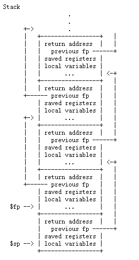
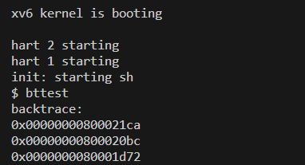
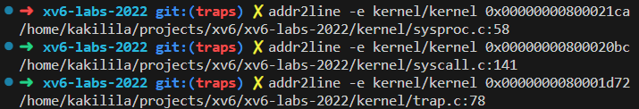
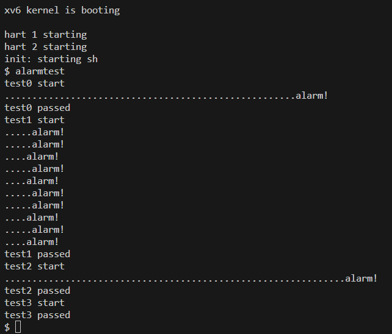

<center><font size=5>Lab-2 report</font></center>
<p align='right'>刘卓瀚-21307130254</p>
<p align='right'>2023-10-11</p>

# task 1
### 1
`a2`
### 2
对`f`的调用在第`26`行（因为返回结果是固定的，编译器直接计算了此结果）
```
  26:	45b1                	li	a1,12
```
对`g`的调用在第`14`行（编译器内联了对函数的调用）
```
  14:	250d                	addiw	a0,a0,3
```
### 3
`0x64a`
### 4
`0x38`
### 5
`He110 World`  
`unsigned int i = 0x726c6400;`  
不需要修改
### 6
会打印出来在调用`printf`之前的第三个参数寄存器原有的值。因为给的format表明`printf`还需要接收两个`int`参数，所以按照约定他会从第三个参数寄存器中取出值作为第二个`%d`的值，但是由于我们没有给`printf`传递第三个参数，所以这个值是在调用`printf`函数之前第三个参数寄存器原有的值。

# task 2
### 实现思路
- 获取当前`fp`指针
```c
static inline uint64 r_fp() {
  uint64 x;
  asm volatile("mv %0, s0" : "=r" (x) );
  return x;
}
```
- 在`kernel/defs.h`添加`backtrace()`的声明，在`kernel/printf.c`中实现`backtrace()`：
  - 根据提示，内核栈都在同一个页中，栈帧依次向下扩展，所以最开始的调用函数的栈帧会从此页的起点处开始，即它的`fp`为此页的起点，且由于地址是与页大小对齐的，所以可以向上找到页大小的整数倍就是此页的起点了（根据`PGROUNDUP()`宏函数），以此为是否遍历到最开始的调用者的依据；
  - 根据如下所示的栈帧的排列，`fp`下8byte是函数的返回地址，下16byte是上一个函数的`fp`，所以可以打印返回地址并找到上一个函数的`fp`，以此类推，直到`fp`的值大于等于此页的起点，即遍历到最开始的调用者。  

```c
void backtrace()
{
  printf("backtrace:\n");
  uint64 fp = r_fp();
  uint64 kstart = PGROUNDUP(fp);
  while (fp < kstart)
  {
    printf("%p\n", *((uint64 *)fp - 1));
    fp = *((uint64 *)fp - 2);
  }
}
```
### 测试结果


### 实验中遇到的问题，如何思考并解决
- 看官方文档的描述以为`r_fp()`函数返回的是对`fp`的指针，所以一直少打印一个输出，实际上是返回`fp`的值

# task 3
### 实现思路
- 修改`kernel/sysproc.c` `kernel/syscall.c` `kernel/syscall.h` `user/usys.pl` `user/user.h`添加系统调用`sys_sigalarm()`和`sys_sigreturn()`
- task0：在`kernel/proc.h`中添加三个变量`uint64 handler;` `int ticks;` `int counter;`，分别表示alarm的处理函数、间隔数和当前的经过了多少个间隔
  - 在`sys_sigalarm()`中用`argint()`和`argaddr()`获取参数，然后将参数赋值给`ticks`和`handler`，并将`counter`置为0
  - 当cpu遇到时钟中断时（对应`kernel/trap.c`中`if (which_dev == 2)`的情况），先判断alarm是否开启（根据`ticks`是否大于`0`）如果是就递增`counter`，表示经过了一个时钟周期
  - 当`counter`大于等于`ticks`时，就调用`handler`，并将`counter`置为0；因为`handler`是用户态的函数，也会修改用户态中的变量，所以在内核态中不能直接调用，方法是将陷阱的返回地址由原本的`trapframe`中的`epc`改为`handler`的地址，这样从陷阱返回用户态的时候就会跳转到`handler`中，所以只需把`trapframe`中的`epc`改为`handler`的地址即可，这样就能保证能跳到`handler`中，就能通过task0
- task1~3：虽然能调用`handler`，但是还需要保证`handler`结束之后能返回到最初被时钟中断的地方，并且相应的环境（寄存器的值）不能改变（`handler`是有可能改变寄存器的值的），也就是说，需要保证好像`handler`从没被调用一样，时钟中断好像仅仅完成了一次陷入陷阱和从陷阱中返回
  - 因为保证了`handler`的末尾一定会调用`sigreturn`，所以可以在将要调用`handler`的时候先保存此时的`trapframe`，然后在`sys_sigreturn`中将`trapframe`恢复，这样就能保证`handler`结束之后能返回到最初被时钟中断的地方，并且相应的环境（寄存器的值）不会改变；在`proc`结构体中新添加一项`former_trapframe`用于存储调用`handler`之前的`trapframe`
  - 要防止在执行`handler`的时候再次发生时钟中断，然后再次进入`handler`，所以在`proc`结构体中再添加一项`int handler_end`，表示`handler`是否结束，当其为`1`时才能进入`handler`，并且将其置为`0`；当`handler`结束，调用`sigreturn`时，在`sys_sigreturn`中将其置为`1`；还需要修改`counter`，因为在`handler`的处理过程中如果发生中断`counter`还是会递增，而`counter`应该表示的是在`handler`执行完之后经过的时钟周期，所以应该在`sys_sigreturn`中将`counter`置为0
  - 因为`sys_return`是有一个`uint64`的返回值的，会存储在`a0`中，在`trampoline.S/userret`中除了`a0`寄存器都会恢复，所以我们还需要额外恢复`a0`寄存器为`former_trapframe`中的`a0`，我的方法是直接将返回值设为`former_trapframe`中的`a0`
  - 在`kernel/proc.c`中，`allocproc()`中初始化`proc`中新添加的变量，在`freeproc`中释放新添加的变量

### 测试结果
`alarmtest`

`usertests -q`（暂时关闭了`backtrace()`，不然会打印很多）
```
$ usertests -q
usertests starting
test copyin: OK
test copyout: OK
test copyinstr1: OK
test copyinstr2: OK
test copyinstr3: OK
test rwsbrk: OK
test truncate1: OK
test truncate2: OK
test truncate3: OK
test openiput: OK
test exitiput: OK
test iput: OK
test opentest: OK
test writetest: OK
test writebig: OK
test createtest: OK
test dirtest: OK
test exectest: OK
test pipe1: OK
test killstatus: OK
test preempt: kill... wait... OK
test exitwait: OK
test reparent: OK
test twochildren: OK
test forkfork: OK
test forkforkfork: OK
test reparent2: OK
test mem: OK
test sharedfd: OK
test fourfiles: OK
test createdelete: OK
test unlinkread: OK
test linktest: OK
test concreate: OK
test linkunlink: OK
test subdir: OK
test bigwrite: OK
test bigfile: OK
test fourteen: OK
test rmdot: OK
test dirfile: OK
test iref: OK
test forktest: OK
test sbrkbasic: OK
test sbrkmuch: OK
test kernmem: usertrap(): unexpected scause 0x000000000000000d pid=6475
            sepc=0x00000000000021f2 stval=0x0000000080000000
usertrap(): unexpected scause 0x000000000000000d pid=6476
            sepc=0x00000000000021f2 stval=0x000000008000c350
usertrap(): unexpected scause 0x000000000000000d pid=6477
            sepc=0x00000000000021f2 stval=0x00000000800186a0
usertrap(): unexpected scause 0x000000000000000d pid=6478
            sepc=0x00000000000021f2 stval=0x00000000800249f0
usertrap(): unexpected scause 0x000000000000000d pid=6479
            sepc=0x00000000000021f2 stval=0x0000000080030d40
usertrap(): unexpected scause 0x000000000000000d pid=6480
            sepc=0x00000000000021f2 stval=0x000000008003d090
usertrap(): unexpected scause 0x000000000000000d pid=6481
            sepc=0x00000000000021f2 stval=0x00000000800493e0
usertrap(): unexpected scause 0x000000000000000d pid=6482
            sepc=0x00000000000021f2 stval=0x0000000080055730
usertrap(): unexpected scause 0x000000000000000d pid=6483
            sepc=0x00000000000021f2 stval=0x0000000080061a80
usertrap(): unexpected scause 0x000000000000000d pid=6484
            sepc=0x00000000000021f2 stval=0x000000008006ddd0
usertrap(): unexpected scause 0x000000000000000d pid=6485
            sepc=0x00000000000021f2 stval=0x000000008007a120
usertrap(): unexpected scause 0x000000000000000d pid=6486
            sepc=0x00000000000021f2 stval=0x0000000080086470
usertrap(): unexpected scause 0x000000000000000d pid=6487
            sepc=0x00000000000021f2 stval=0x00000000800927c0
usertrap(): unexpected scause 0x000000000000000d pid=6488
            sepc=0x00000000000021f2 stval=0x000000008009eb10
usertrap(): unexpected scause 0x000000000000000d pid=6489
            sepc=0x00000000000021f2 stval=0x00000000800aae60
usertrap(): unexpected scause 0x000000000000000d pid=6490
            sepc=0x00000000000021f2 stval=0x00000000800b71b0
usertrap(): unexpected scause 0x000000000000000d pid=6491
            sepc=0x00000000000021f2 stval=0x00000000800c3500
usertrap(): unexpected scause 0x000000000000000d pid=6492
            sepc=0x00000000000021f2 stval=0x00000000800cf850
usertrap(): unexpected scause 0x000000000000000d pid=6493
            sepc=0x00000000000021f2 stval=0x00000000800dbba0
usertrap(): unexpected scause 0x000000000000000d pid=6494
            sepc=0x00000000000021f2 stval=0x00000000800e7ef0
usertrap(): unexpected scause 0x000000000000000d pid=6495
            sepc=0x00000000000021f2 stval=0x00000000800f4240
usertrap(): unexpected scause 0x000000000000000d pid=6496
            sepc=0x00000000000021f2 stval=0x0000000080100590
usertrap(): unexpected scause 0x000000000000000d pid=6497
            sepc=0x00000000000021f2 stval=0x000000008010c8e0
usertrap(): unexpected scause 0x000000000000000d pid=6498
            sepc=0x00000000000021f2 stval=0x0000000080118c30
usertrap(): unexpected scause 0x000000000000000d pid=6499
            sepc=0x00000000000021f2 stval=0x0000000080124f80
usertrap(): unexpected scause 0x000000000000000d pid=6500
            sepc=0x00000000000021f2 stval=0x00000000801312d0
usertrap(): unexpected scause 0x000000000000000d pid=6501
            sepc=0x00000000000021f2 stval=0x000000008013d620
usertrap(): unexpected scause 0x000000000000000d pid=6502
            sepc=0x00000000000021f2 stval=0x0000000080149970
usertrap(): unexpected scause 0x000000000000000d pid=6503
            sepc=0x00000000000021f2 stval=0x0000000080155cc0
usertrap(): unexpected scause 0x000000000000000d pid=6504
            sepc=0x00000000000021f2 stval=0x0000000080162010
usertrap(): unexpected scause 0x000000000000000d pid=6505
            sepc=0x00000000000021f2 stval=0x000000008016e360
usertrap(): unexpected scause 0x000000000000000d pid=6506
            sepc=0x00000000000021f2 stval=0x000000008017a6b0
usertrap(): unexpected scause 0x000000000000000d pid=6507
            sepc=0x00000000000021f2 stval=0x0000000080186a00
usertrap(): unexpected scause 0x000000000000000d pid=6508
            sepc=0x00000000000021f2 stval=0x0000000080192d50
usertrap(): unexpected scause 0x000000000000000d pid=6509
            sepc=0x00000000000021f2 stval=0x000000008019f0a0
usertrap(): unexpected scause 0x000000000000000d pid=6510
            sepc=0x00000000000021f2 stval=0x00000000801ab3f0
usertrap(): unexpected scause 0x000000000000000d pid=6511
            sepc=0x00000000000021f2 stval=0x00000000801b7740
usertrap(): unexpected scause 0x000000000000000d pid=6512
            sepc=0x00000000000021f2 stval=0x00000000801c3a90
usertrap(): unexpected scause 0x000000000000000d pid=6513
            sepc=0x00000000000021f2 stval=0x00000000801cfde0
usertrap(): unexpected scause 0x000000000000000d pid=6514
            sepc=0x00000000000021f2 stval=0x00000000801dc130
OK
test MAXVAplus: usertrap(): unexpected scause 0x000000000000000f pid=6516
            sepc=0x000000000000229e stval=0x0000004000000000
usertrap(): unexpected scause 0x000000000000000f pid=6517
            sepc=0x000000000000229e stval=0x0000008000000000
usertrap(): unexpected scause 0x000000000000000f pid=6518
            sepc=0x000000000000229e stval=0x0000010000000000
usertrap(): unexpected scause 0x000000000000000f pid=6519
            sepc=0x000000000000229e stval=0x0000020000000000
usertrap(): unexpected scause 0x000000000000000f pid=6520
            sepc=0x000000000000229e stval=0x0000040000000000
usertrap(): unexpected scause 0x000000000000000f pid=6521
            sepc=0x000000000000229e stval=0x0000080000000000
usertrap(): unexpected scause 0x000000000000000f pid=6522
            sepc=0x000000000000229e stval=0x0000100000000000
usertrap(): unexpected scause 0x000000000000000f pid=6523
            sepc=0x000000000000229e stval=0x0000200000000000
usertrap(): unexpected scause 0x000000000000000f pid=6524
            sepc=0x000000000000229e stval=0x0000400000000000
usertrap(): unexpected scause 0x000000000000000f pid=6525
            sepc=0x000000000000229e stval=0x0000800000000000
usertrap(): unexpected scause 0x000000000000000f pid=6526
            sepc=0x000000000000229e stval=0x0001000000000000
usertrap(): unexpected scause 0x000000000000000f pid=6527
            sepc=0x000000000000229e stval=0x0002000000000000
usertrap(): unexpected scause 0x000000000000000f pid=6528
            sepc=0x000000000000229e stval=0x0004000000000000
usertrap(): unexpected scause 0x000000000000000f pid=6529
            sepc=0x000000000000229e stval=0x0008000000000000
usertrap(): unexpected scause 0x000000000000000f pid=6530
            sepc=0x000000000000229e stval=0x0010000000000000
usertrap(): unexpected scause 0x000000000000000f pid=6531
            sepc=0x000000000000229e stval=0x0020000000000000
usertrap(): unexpected scause 0x000000000000000f pid=6532
            sepc=0x000000000000229e stval=0x0040000000000000
usertrap(): unexpected scause 0x000000000000000f pid=6533
            sepc=0x000000000000229e stval=0x0080000000000000
usertrap(): unexpected scause 0x000000000000000f pid=6534
            sepc=0x000000000000229e stval=0x0100000000000000
usertrap(): unexpected scause 0x000000000000000f pid=6535
            sepc=0x000000000000229e stval=0x0200000000000000
usertrap(): unexpected scause 0x000000000000000f pid=6536
            sepc=0x000000000000229e stval=0x0400000000000000
usertrap(): unexpected scause 0x000000000000000f pid=6537
            sepc=0x000000000000229e stval=0x0800000000000000
usertrap(): unexpected scause 0x000000000000000f pid=6538
            sepc=0x000000000000229e stval=0x1000000000000000
usertrap(): unexpected scause 0x000000000000000f pid=6539
            sepc=0x000000000000229e stval=0x2000000000000000
usertrap(): unexpected scause 0x000000000000000f pid=6540
            sepc=0x000000000000229e stval=0x4000000000000000
usertrap(): unexpected scause 0x000000000000000f pid=6541
            sepc=0x000000000000229e stval=0x8000000000000000
OK
test sbrkfail: usertrap(): unexpected scause 0x000000000000000d pid=6553
            sepc=0x0000000000004994 stval=0x0000000000013000
OK
test sbrkarg: OK
test validatetest: OK
test bsstest: OK
test bigargtest: OK
test argptest: OK
test stacktest: usertrap(): unexpected scause 0x000000000000000d pid=6561
            sepc=0x0000000000002410 stval=0x0000000000010eb0
OK
test textwrite: usertrap(): unexpected scause 0x000000000000000f pid=6563
            sepc=0x0000000000002490 stval=0x0000000000000000
OK
test pgbug: OK
test sbrkbugs: usertrap(): unexpected scause 0x000000000000000c pid=6566
            sepc=0x0000000000005c5e stval=0x0000000000005c5e
usertrap(): unexpected scause 0x000000000000000c pid=6567
            sepc=0x0000000000005c5e stval=0x0000000000005c5e
OK
test sbrklast: OK
test sbrk8000: OK
test badarg: OK
ALL TESTS PASSED
```

### 实验中遇到的问题，如何思考并解决
- 真难！
- 一开始发现在内核态运行不了`handler`这个函数，debug发现`handler`的地址是0，就一直在纠结为什么是0，结果看`alarmtest.asm`和用`gdb`调试后才发现`periodic()`函数的地址本来就是0，然后就纠结怎么跳转到用户态为0的地址......后来想到了`handler`还要修改用户态的变量，所以应该在用户态执行
- 开始想改`usertrapret()`让他`w_sepc()`设置别的值，后来发现只需改改`epc`就好了，反正之后也会全部恢复的
- 搞了好久才真正理解题目要干什么