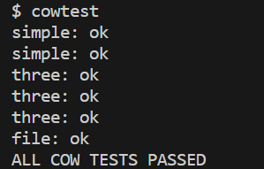

<center><font size = 5>Lab 5 Report</font></center>
<p align = 'right'>刘卓瀚 21307130254</p>

# task 1
### 实现思路
- 在`riscv.h`中定义`PTE_C`表示是否为copy-on-write页，使用保留的页表项的第9位(`1<<8`)
- 修改`vm.c`中的`vmcopy`函数，如果`PTE_W`为1（可写），则将`PTE_C`置为1，同时消除`PTE_W`位，即将此页置为copy-on-write页；如果`PTE_W`为0，则不变。然后将此页在子进程的页表中实现映射，映射到父进程的页表中的相同的物理地址，完成copy-on-write
- 修改`trap.c`函数，检测write page fault（scause = 15），如果发生page fault的是copy-on-write页（不可写但`PTE_C`存在），则分配一块新的内存，将原来的内容复制到新内存，取消原来的映射，调用`kfree()`，将新内存映射到原来的虚拟地址，同时将`PTE_W`置为1并消除`PTE_C`位
- 修改`kalloc.c`，为kalloc分配的每个页增加引用计数（因为可能有多个进程的某个虚拟地址映射到同一块物理地址），用锁保护引用计数的修改，当调用`kfree()`时，递减引用计数，当引用计数>0时，不释放内存，当引用计数<=0时，释放内存；当调用`kalloc()`时将引用计数初始化为1；修改`vmcopy()`，对映射到同一块物理地址的页，递增其引用计数
- 修改`vm.c`中的`copyout`函数，和`trap.c`中的实现类似，如果发生page fault的是copy-on-write页，则分配一块新的内存，将原来的内容复制到新内存，取消原来的映射，调用`kfree()`，将新内存映射到原来的虚拟地址，同时将`PTE_W`置为1并消除`PTE_C`位
### 测试结果

```
$ usertests -q
usertests starting
test copyin: OK
test copyout: OK
test copyinstr1: OK
test copyinstr2: OK
test copyinstr3: OK
test rwsbrk: OK
test truncate1: OK
test truncate2: OK
test truncate3: OK
test openiput: OK
test exitiput: OK
test iput: OK
test opentest: OK
test writetest: OK
test writebig: OK
test createtest: OK
test dirtest: OK
test exectest: OK
test pipe1: OK
test killstatus: OK
test preempt: kill... wait... OK
test exitwait: OK
test reparent: OK
test twochildren: OK
test forkfork: OK
test forkforkfork: OK
test reparent2: OK
test mem: OK
test sharedfd: OK
test fourfiles: OK
test createdelete: OK
test unlinkread: OK
test linktest: OK
test concreate: OK
test linkunlink: OK
test subdir: OK
test bigwrite: OK
test bigfile: OK
test fourteen: OK
test rmdot: OK
test dirfile: OK
test iref: OK
test forktest: OK
test sbrkbasic: OK
test sbrkmuch: OK
test kernmem: usertrap(): unexpected scause 0x000000000000000d pid=6488
            sepc=0x00000000000021f2 stval=0x0000000080000000
usertrap(): unexpected scause 0x000000000000000d pid=6489
            sepc=0x00000000000021f2 stval=0x000000008000c350
usertrap(): unexpected scause 0x000000000000000d pid=6490
            sepc=0x00000000000021f2 stval=0x00000000800186a0
usertrap(): unexpected scause 0x000000000000000d pid=6491
            sepc=0x00000000000021f2 stval=0x00000000800249f0
usertrap(): unexpected scause 0x000000000000000d pid=6492
            sepc=0x00000000000021f2 stval=0x0000000080030d40
usertrap(): unexpected scause 0x000000000000000d pid=6493
            sepc=0x00000000000021f2 stval=0x000000008003d090
usertrap(): unexpected scause 0x000000000000000d pid=6494
            sepc=0x00000000000021f2 stval=0x00000000800493e0
usertrap(): unexpected scause 0x000000000000000d pid=6495
            sepc=0x00000000000021f2 stval=0x0000000080055730
usertrap(): unexpected scause 0x000000000000000d pid=6496
            sepc=0x00000000000021f2 stval=0x0000000080061a80
usertrap(): unexpected scause 0x000000000000000d pid=6497
            sepc=0x00000000000021f2 stval=0x000000008006ddd0
usertrap(): unexpected scause 0x000000000000000d pid=6498
            sepc=0x00000000000021f2 stval=0x000000008007a120
usertrap(): unexpected scause 0x000000000000000d pid=6499
            sepc=0x00000000000021f2 stval=0x0000000080086470
usertrap(): unexpected scause 0x000000000000000d pid=6500
            sepc=0x00000000000021f2 stval=0x00000000800927c0
usertrap(): unexpected scause 0x000000000000000d pid=6501
            sepc=0x00000000000021f2 stval=0x000000008009eb10
usertrap(): unexpected scause 0x000000000000000d pid=6502
            sepc=0x00000000000021f2 stval=0x00000000800aae60
usertrap(): unexpected scause 0x000000000000000d pid=6503
            sepc=0x00000000000021f2 stval=0x00000000800b71b0
usertrap(): unexpected scause 0x000000000000000d pid=6504
            sepc=0x00000000000021f2 stval=0x00000000800c3500
usertrap(): unexpected scause 0x000000000000000d pid=6505
            sepc=0x00000000000021f2 stval=0x00000000800cf850
usertrap(): unexpected scause 0x000000000000000d pid=6506
            sepc=0x00000000000021f2 stval=0x00000000800dbba0
usertrap(): unexpected scause 0x000000000000000d pid=6507
            sepc=0x00000000000021f2 stval=0x00000000800e7ef0
usertrap(): unexpected scause 0x000000000000000d pid=6508
            sepc=0x00000000000021f2 stval=0x00000000800f4240
usertrap(): unexpected scause 0x000000000000000d pid=6509
            sepc=0x00000000000021f2 stval=0x0000000080100590
usertrap(): unexpected scause 0x000000000000000d pid=6510
            sepc=0x00000000000021f2 stval=0x000000008010c8e0
usertrap(): unexpected scause 0x000000000000000d pid=6511
            sepc=0x00000000000021f2 stval=0x0000000080118c30
usertrap(): unexpected scause 0x000000000000000d pid=6512
            sepc=0x00000000000021f2 stval=0x0000000080124f80
usertrap(): unexpected scause 0x000000000000000d pid=6513
            sepc=0x00000000000021f2 stval=0x00000000801312d0
usertrap(): unexpected scause 0x000000000000000d pid=6514
            sepc=0x00000000000021f2 stval=0x000000008013d620
usertrap(): unexpected scause 0x000000000000000d pid=6515
            sepc=0x00000000000021f2 stval=0x0000000080149970
usertrap(): unexpected scause 0x000000000000000d pid=6516
            sepc=0x00000000000021f2 stval=0x0000000080155cc0
usertrap(): unexpected scause 0x000000000000000d pid=6517
            sepc=0x00000000000021f2 stval=0x0000000080162010
usertrap(): unexpected scause 0x000000000000000d pid=6518
            sepc=0x00000000000021f2 stval=0x000000008016e360
usertrap(): unexpected scause 0x000000000000000d pid=6519
            sepc=0x00000000000021f2 stval=0x000000008017a6b0
usertrap(): unexpected scause 0x000000000000000d pid=6520
            sepc=0x00000000000021f2 stval=0x0000000080186a00
usertrap(): unexpected scause 0x000000000000000d pid=6521
            sepc=0x00000000000021f2 stval=0x0000000080192d50
usertrap(): unexpected scause 0x000000000000000d pid=6522
            sepc=0x00000000000021f2 stval=0x000000008019f0a0
usertrap(): unexpected scause 0x000000000000000d pid=6523
            sepc=0x00000000000021f2 stval=0x00000000801ab3f0
usertrap(): unexpected scause 0x000000000000000d pid=6524
            sepc=0x00000000000021f2 stval=0x00000000801b7740
usertrap(): unexpected scause 0x000000000000000d pid=6525
            sepc=0x00000000000021f2 stval=0x00000000801c3a90
usertrap(): unexpected scause 0x000000000000000d pid=6526
            sepc=0x00000000000021f2 stval=0x00000000801cfde0
usertrap(): unexpected scause 0x000000000000000d pid=6527
            sepc=0x00000000000021f2 stval=0x00000000801dc130
OK
test MAXVAplus: OK
test sbrkfail: usertrap(): unexpected scause 0x000000000000000d pid=6566
            sepc=0x0000000000004994 stval=0x0000000000013000
OK
test sbrkarg: OK
test validatetest: OK
test bsstest: OK
test bigargtest: OK
test argptest: OK
test stacktest: usertrap(): unexpected scause 0x000000000000000d pid=6574
            sepc=0x0000000000002410 stval=0x0000000000010eb0
OK
test textwrite: OK
test pgbug: OK
test sbrkbugs: usertrap(): unexpected scause 0x000000000000000c pid=6579
            sepc=0x0000000000005c5e stval=0x0000000000005c5e
usertrap(): unexpected scause 0x000000000000000c pid=6580
            sepc=0x0000000000005c5e stval=0x0000000000005c5e
OK
test sbrklast: OK
test sbrk8000: OK
test badarg: OK
ALL TESTS PASSED
```
### 实验中遇到的问题，如何思考并解决
- 遇到`cowtest`卡住没有输出的情况；思考和解决：第一次遇到是卡在`simpletest`里面，我再运行`usertests -q`发现也卡住了，所以我推断我大概是把系统搞崩了，因为之前设置了太多debug的信息，代码已经混乱不堪，所以我重新写了一遍；第二遍卡在了`filetest`里面，经过debug发现是卡在`read`里面了，因为`read`会调用`copyout`，我再次检查我的`copyout`的实现，发现了错误