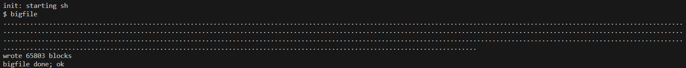
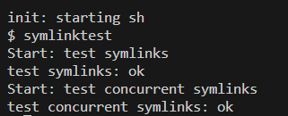
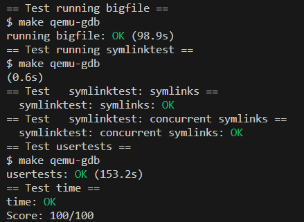

<center><font size = 5>Lab 6 Report</font></center>
<p align = 'right'>刘卓瀚 21307130254</p>

# task 1
### 实现思路
- 修改`fs.h`中`NDIRECT`的数目为11，增加`NDINDIRECT`的定义为12（表示二级间接指针的位置）
- 修改`dinode`和`inode`结构体中`addrs`的定义，将`NDIRECT + 1`改为`NDIRECT + 1 + 1`
- 修改`kernel/fs.c`中的`bmap`函数，仿照一级间接指针和直接指针的处理方式，增加对二级间接指针的处理，一级一级向下嵌套进行处理
- 修改`kernel/fs.c`中的`itrunc`函数，增加对二级间接指针的释放，仿照一级间接指针和直接指针的处理方式，一级一级向下嵌套进行释放

`bmap`:
```c
  int idx = 0;
  int offset = 0;
  if (bn < NINDIRECT * NINDIRECT)
  {
    if ((addr = ip->addrs[NDINDIRECT]) == 0)
    {
      addr = balloc(ip->dev);
      if (addr == 0)
        return 0;
      ip->addrs[NDINDIRECT] = addr;
    }
    bp = bread(ip->dev, addr);
    a = (uint *)bp->data;
    idx = bn / NINDIRECT;
    if ((addr = a[idx]) == 0)
    {
      addr = balloc(ip->dev);
      if (addr == 0)
      {
        return 0;
      }
      a[idx] = addr;
      log_write(bp);
    }
    brelse(bp);
    bp = bread(ip->dev, addr);
    a = (uint *)bp->data;
    offset = bn % NINDIRECT;
    if ((addr = a[offset]) == 0)
    {
      addr = balloc(ip->dev);
      if (addr)
      {
        a[offset] = addr;
        log_write(bp);
      }
    }
    brelse(bp);
    return addr;
  }
```

`itrunc`:
```c
int k;
  struct buf *bp2;
  uint *a2;
  if (ip->addrs[NDINDIRECT])
  {
    bp = bread(ip->dev, ip->addrs[NDINDIRECT]);
    a = (uint *)bp->data;
    for (j = 0; j < NINDIRECT; j++)
    {
      if (a[j])
      {
        bp2 = bread(ip->dev, a[j]);
        a2 = (uint *)bp2->data;
        for (k = 0; k < NINDIRECT; k++)
        {
          if (a2[k])
            bfree(ip->dev, a2[k]);
        }
        brelse(bp2);
        bfree(ip->dev, a[j]);
      }
    }
    brelse(bp);
    bfree(ip->dev, ip->addrs[NDINDIRECT]);
    ip->addrs[NDINDIRECT] = 0;
  }
```
### 测试结果

```
$ usertests -q
usertests starting
test copyin: OK
test copyout: OK
test copyinstr1: OK
test copyinstr2: OK
test copyinstr3: OK
test rwsbrk: OK
test truncate1: OK
test truncate2: OK
test truncate3: OK
test openiput: OK
test exitiput: OK
test iput: OK
test opentest: OK
test writetest: OK
test writebig: OK
test createtest: OK
test dirtest: OK
test exectest: OK
test pipe1: OK
test killstatus: OK
test preempt: kill... wait... OK
test exitwait: OK
test reparent: OK
test twochildren: OK
test forkfork: OK
test forkforkfork: OK
test reparent2: OK
test mem: OK
test sharedfd: OK
test fourfiles: OK
test createdelete: OK
test unlinkread: OK
test linktest: OK
test concreate: OK
test linkunlink: OK
test subdir: OK
test bigwrite: OK
test bigfile: OK
test fourteen: OK
test rmdot: OK
test dirfile: OK
test iref: OK
test forktest: OK
test sbrkbasic: OK
test sbrkmuch: OK
test kernmem: usertrap(): unexpected scause 0x000000000000000d pid=6370
            sepc=0x00000000000021f4 stval=0x0000000080000000
usertrap(): unexpected scause 0x000000000000000d pid=6371
            sepc=0x00000000000021f4 stval=0x000000008000c350
usertrap(): unexpected scause 0x000000000000000d pid=6372
            sepc=0x00000000000021f4 stval=0x00000000800186a0
usertrap(): unexpected scause 0x000000000000000d pid=6373
            sepc=0x00000000000021f4 stval=0x00000000800249f0
usertrap(): unexpected scause 0x000000000000000d pid=6374
            sepc=0x00000000000021f4 stval=0x0000000080030d40
usertrap(): unexpected scause 0x000000000000000d pid=6375
            sepc=0x00000000000021f4 stval=0x000000008003d090
usertrap(): unexpected scause 0x000000000000000d pid=6376
            sepc=0x00000000000021f4 stval=0x00000000800493e0
usertrap(): unexpected scause 0x000000000000000d pid=6377
            sepc=0x00000000000021f4 stval=0x0000000080055730
usertrap(): unexpected scause 0x000000000000000d pid=6378
            sepc=0x00000000000021f4 stval=0x0000000080061a80
usertrap(): unexpected scause 0x000000000000000d pid=6379
            sepc=0x00000000000021f4 stval=0x000000008006ddd0
usertrap(): unexpected scause 0x000000000000000d pid=6380
            sepc=0x00000000000021f4 stval=0x000000008007a120
usertrap(): unexpected scause 0x000000000000000d pid=6381
            sepc=0x00000000000021f4 stval=0x0000000080086470
usertrap(): unexpected scause 0x000000000000000d pid=6382
            sepc=0x00000000000021f4 stval=0x00000000800927c0
usertrap(): unexpected scause 0x000000000000000d pid=6383
            sepc=0x00000000000021f4 stval=0x000000008009eb10
usertrap(): unexpected scause 0x000000000000000d pid=6384
            sepc=0x00000000000021f4 stval=0x00000000800aae60
usertrap(): unexpected scause 0x000000000000000d pid=6385
            sepc=0x00000000000021f4 stval=0x00000000800b71b0
usertrap(): unexpected scause 0x000000000000000d pid=6386
            sepc=0x00000000000021f4 stval=0x00000000800c3500
usertrap(): unexpected scause 0x000000000000000d pid=6387
            sepc=0x00000000000021f4 stval=0x00000000800cf850
usertrap(): unexpected scause 0x000000000000000d pid=6388
            sepc=0x00000000000021f4 stval=0x00000000800dbba0
usertrap(): unexpected scause 0x000000000000000d pid=6389
            sepc=0x00000000000021f4 stval=0x00000000800e7ef0
usertrap(): unexpected scause 0x000000000000000d pid=6390
            sepc=0x00000000000021f4 stval=0x00000000800f4240
usertrap(): unexpected scause 0x000000000000000d pid=6391
            sepc=0x00000000000021f4 stval=0x0000000080100590
usertrap(): unexpected scause 0x000000000000000d pid=6392
            sepc=0x00000000000021f4 stval=0x000000008010c8e0
usertrap(): unexpected scause 0x000000000000000d pid=6393
            sepc=0x00000000000021f4 stval=0x0000000080118c30
usertrap(): unexpected scause 0x000000000000000d pid=6394
            sepc=0x00000000000021f4 stval=0x0000000080124f80
usertrap(): unexpected scause 0x000000000000000d pid=6395
            sepc=0x00000000000021f4 stval=0x00000000801312d0
usertrap(): unexpected scause 0x000000000000000d pid=6396
            sepc=0x00000000000021f4 stval=0x000000008013d620
usertrap(): unexpected scause 0x000000000000000d pid=6397
            sepc=0x00000000000021f4 stval=0x0000000080149970
usertrap(): unexpected scause 0x000000000000000d pid=6398
            sepc=0x00000000000021f4 stval=0x0000000080155cc0
usertrap(): unexpected scause 0x000000000000000d pid=6399
            sepc=0x00000000000021f4 stval=0x0000000080162010
usertrap(): unexpected scause 0x000000000000000d pid=6400
            sepc=0x00000000000021f4 stval=0x000000008016e360
usertrap(): unexpected scause 0x000000000000000d pid=6401
            sepc=0x00000000000021f4 stval=0x000000008017a6b0
usertrap(): unexpected scause 0x000000000000000d pid=6402
            sepc=0x00000000000021f4 stval=0x0000000080186a00
usertrap(): unexpected scause 0x000000000000000d pid=6403
            sepc=0x00000000000021f4 stval=0x0000000080192d50
usertrap(): unexpected scause 0x000000000000000d pid=6404
            sepc=0x00000000000021f4 stval=0x000000008019f0a0
usertrap(): unexpected scause 0x000000000000000d pid=6405
            sepc=0x00000000000021f4 stval=0x00000000801ab3f0
usertrap(): unexpected scause 0x000000000000000d pid=6406
            sepc=0x00000000000021f4 stval=0x00000000801b7740
usertrap(): unexpected scause 0x000000000000000d pid=6407
            sepc=0x00000000000021f4 stval=0x00000000801c3a90
usertrap(): unexpected scause 0x000000000000000d pid=6408
            sepc=0x00000000000021f4 stval=0x00000000801cfde0
usertrap(): unexpected scause 0x000000000000000d pid=6409
            sepc=0x00000000000021f4 stval=0x00000000801dc130
OK
test MAXVAplus: usertrap(): unexpected scause 0x000000000000000f pid=6411
            sepc=0x00000000000022a0 stval=0x0000004000000000
usertrap(): unexpected scause 0x000000000000000f pid=6412
            sepc=0x00000000000022a0 stval=0x0000008000000000
usertrap(): unexpected scause 0x000000000000000f pid=6413
            sepc=0x00000000000022a0 stval=0x0000010000000000
usertrap(): unexpected scause 0x000000000000000f pid=6414
            sepc=0x00000000000022a0 stval=0x0000020000000000
usertrap(): unexpected scause 0x000000000000000f pid=6415
            sepc=0x00000000000022a0 stval=0x0000040000000000
usertrap(): unexpected scause 0x000000000000000f pid=6416
            sepc=0x00000000000022a0 stval=0x0000080000000000
usertrap(): unexpected scause 0x000000000000000f pid=6417
            sepc=0x00000000000022a0 stval=0x0000100000000000
usertrap(): unexpected scause 0x000000000000000f pid=6418
            sepc=0x00000000000022a0 stval=0x0000200000000000
usertrap(): unexpected scause 0x000000000000000f pid=6419
            sepc=0x00000000000022a0 stval=0x0000400000000000
usertrap(): unexpected scause 0x000000000000000f pid=6420
            sepc=0x00000000000022a0 stval=0x0000800000000000
usertrap(): unexpected scause 0x000000000000000f pid=6421
            sepc=0x00000000000022a0 stval=0x0001000000000000
usertrap(): unexpected scause 0x000000000000000f pid=6422
            sepc=0x00000000000022a0 stval=0x0002000000000000
usertrap(): unexpected scause 0x000000000000000f pid=6423
            sepc=0x00000000000022a0 stval=0x0004000000000000
usertrap(): unexpected scause 0x000000000000000f pid=6424
            sepc=0x00000000000022a0 stval=0x0008000000000000
usertrap(): unexpected scause 0x000000000000000f pid=6425
            sepc=0x00000000000022a0 stval=0x0010000000000000
usertrap(): unexpected scause 0x000000000000000f pid=6426
            sepc=0x00000000000022a0 stval=0x0020000000000000
usertrap(): unexpected scause 0x000000000000000f pid=6427
            sepc=0x00000000000022a0 stval=0x0040000000000000
usertrap(): unexpected scause 0x000000000000000f pid=6428
            sepc=0x00000000000022a0 stval=0x0080000000000000
usertrap(): unexpected scause 0x000000000000000f pid=6429
            sepc=0x00000000000022a0 stval=0x0100000000000000
usertrap(): unexpected scause 0x000000000000000f pid=6430
            sepc=0x00000000000022a0 stval=0x0200000000000000
usertrap(): unexpected scause 0x000000000000000f pid=6431
            sepc=0x00000000000022a0 stval=0x0400000000000000
usertrap(): unexpected scause 0x000000000000000f pid=6432
            sepc=0x00000000000022a0 stval=0x0800000000000000
usertrap(): unexpected scause 0x000000000000000f pid=6433
            sepc=0x00000000000022a0 stval=0x1000000000000000
usertrap(): unexpected scause 0x000000000000000f pid=6434
            sepc=0x00000000000022a0 stval=0x2000000000000000
usertrap(): unexpected scause 0x000000000000000f pid=6435
            sepc=0x00000000000022a0 stval=0x4000000000000000
usertrap(): unexpected scause 0x000000000000000f pid=6436
            sepc=0x00000000000022a0 stval=0x8000000000000000
OK
test sbrkfail: usertrap(): unexpected scause 0x000000000000000d pid=6444
            sepc=0x0000000000004998 stval=0x0000000000013000
OK
test sbrkarg: OK
test validatetest: OK
test bsstest: OK
test bigargtest: OK
test argptest: OK
test stacktest: usertrap(): unexpected scause 0x000000000000000d pid=6452
            sepc=0x0000000000002412 stval=0x0000000000010eb0
OK
test textwrite: usertrap(): unexpected scause 0x000000000000000f pid=6454
            sepc=0x0000000000002492 stval=0x0000000000000000
OK
test pgbug: OK
test sbrkbugs: usertrap(): unexpected scause 0x000000000000000c pid=6457
            sepc=0x0000000000005c62 stval=0x0000000000005c62
usertrap(): unexpected scause 0x000000000000000c pid=6458
            sepc=0x0000000000005c62 stval=0x0000000000005c62
OK
test sbrklast: OK
test sbrk8000: OK
test badarg: OK
ALL TESTS PASSED
```
### 实验中遇到的问题，如何思考并解决
- 一开始没改`NDIRECT`的数目，以为这样可以不用改`dinode`和`inode`结构体中`addrs`的定义，而只需新增两个表示间接指针和二级间接指针的位置的参数，但是发现`NDIRECT`和许多关于直接指针的处理有所关联，这样挺多地方都要改，所以还是改了`NDIRECT`的数目
- 处理二级间接块的时候，只对二级间接块进行了`log_write`，没对一级间接块进行`log_write`

# task 2
### 实现思路
- 在`kernel/sysfile.c`中添加系统调用`sys_symlink`
- 在`kernel/stat.h`中添加`T_SYMLINK`类型，表示此为存储符号链接的文件
- 在`kernel/fcntl.h`中添加`O_NOFOLLOW`，表示不跟随符号链接，即把符号链接的文件当成普通文件来处理，而不是处理符号链接指向的文件
- 实现系统调用`sys_symlink`，首先使用`argstr`获取参数`target`和`path`，前者为符号链接指向的文件，后者为符号链接文件的路径，然后调用`create`创建一个类型为`T_SYMLINK`的文件，路径为`path`，然后将`target`写入到文件中
- 修改`kernel/sysfile.c`中的`sys_open`，增加对`T_SYMLINK`文件的处理，如果不为`O_NOFOLLOW`，则递归跟随符号链接，直到找到一个不是符号链接的文件，再交给后续进行操作；如果为`O_NOFOLLOW`，则直接交给后续进行操作。设置一个递归深度`depth`，如果递归深度超过`10`，则直接返回错误，防止出现循环符号链接的情况（即a->b, b->a），递归处理仿照上下文的处理方式

`sys_symlink`:
```c
uint64 sys_symlink(void)
{
  char target[MAXPATH], path[MAXPATH];
  if (argstr(0, target, MAXPATH) < 0 || argstr(1, path, MAXPATH) < 0)
    return -1;

  // struct inode *dp, *ip;
  struct inode *ip;

  begin_op();
  if ((ip = create(path, T_SYMLINK, 0, 0)) == 0)
  {
    end_op();
    return -1;
  }

  // ilock(ip);
  if (writei(ip, 0, (uint64)target, 0, MAXPATH) < 0)
  {
    iunlockput(ip);
    end_op();
    return -1;
  }

  iunlockput(ip);
  end_op();
  return 0;
}
```

`sys_open`:
```c
  int depth = 0;
  char tmp[MAXPATH];
  if (ip->type == T_SYMLINK && (omode & O_NOFOLLOW) == 0)
  {
    while (ip->type == T_SYMLINK)
    {
      if (depth >= 10)
      {
        iunlockput(ip);
        end_op();
        return -1;
      }
      // ilock(ip);
      if (readi(ip, 0, (uint64)tmp, 0, MAXPATH) == 0)
      {
        iunlockput(ip);
        end_op();
        return -1;
      }
      iunlockput(ip);
      if ((ip = namei(tmp)) == 0)
      {
        end_op();
        return -1;
      }
      ilock(ip);
      depth++;
    }
  }
```

### 测试结果


### 实验中遇到的问题，如何思考并解决
- `sys_link`中，一开始在`writei`之前调用了`ilock`，但其实`create`会返回一个上了锁的`ip`
- `sys_open`中也是，要保证在每个阶段性的操作中`ip`是上了锁的，所以在调用`readi`之前不用上锁，而在释放了锁之后需要重新上锁
- 在`task 1`中忘记更改`inode`结构体中的`addrs`了，但`task 1`能过，`task 2`中出现问题，再仔细读文档发现此处错误